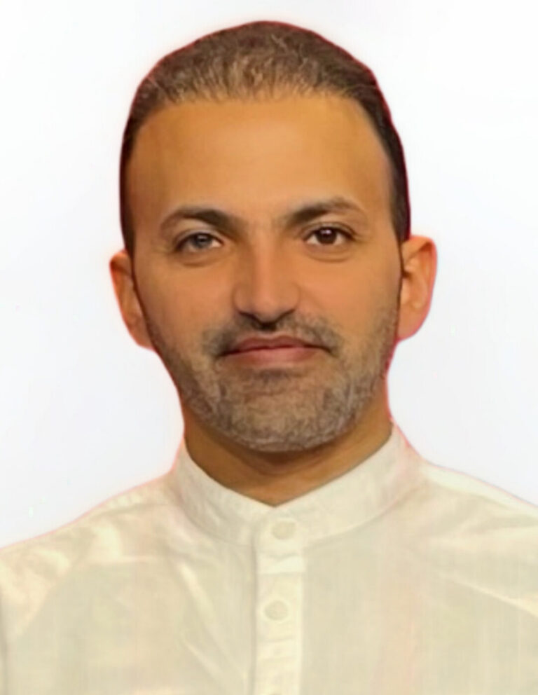

::: {.hero}
::: {.hero-text}
[Heidelberg · Germany]{.eyebrow}

# Tareq Al-Ahdal

::: {.tagline}
Epidemiologist & Data Scientist
:::

::: {.bio}
I work at the intersection of spatial epidemiology, Bayesian modeling, and
health data science — building reproducible analyses that turn large, messy
population and environmental data into evidence people can act on. My methods
span R-INLA spatiotemporal models, Mendelian randomization, and NLP on
geotagged data.
:::

::: {.hero-cta}
[Publications](publications.qmd){.btn-primary-grad}
[View GitHub](https://github.com/alahdalta1){.btn-ghost}
:::
:::

::: {.hero-photo}

:::
:::

::: {.stats}
::: {.stat}
[32+]{.num}

[Publications]{.lbl}
:::
::: {.stat}
[10,000+]{.num}

[Citations]{.lbl}
:::
::: {.stat}
[Q1]{.num}

[Lancet · Cell Press]{.lbl}
:::
:::

::: {.section-head}
## Selected Publications
[]{.rule}
[All publications →](publications.qmd){.section-more}
:::

::: {.pub}
[Lancet]{.badge .lancet}

::: {}
### Climate change and pandemics: a call for action
::: {.venue}
The Lancet Planetary Health · [2025]{.yr}
:::
::: {.tags}
[Climate–health]{.tag}
[Co-author]{.tag}
:::
:::
:::

::: {.pub}
[iScience]{.badge .iscience}

::: {}
### The association of climate-induced stressors on risk of negative sentiment: an analysis from 462 million geotagged tweets in Europe
::: {.venue}
iScience (Cell Press) · [2025]{.yr} · First author
:::
::: {.tags}
[R-INLA / BYM2]{.tag}
[NLP]{.tag}
[Spatiotemporal]{.tag}
:::
:::
:::

::: {.pub}
[iScience]{.badge .iscience}

::: {}
### The impact of climatic factors on negative sentiments: an analysis of human expressions from X in Germany
::: {.venue}
iScience (Cell Press) · [2025]{.yr} · First author
:::
::: {.tags}
[R-INLA]{.tag}
[Sentiment analysis]{.tag}
:::
:::
:::

::: {.section-head}
## Featured Project
[]{.rule}
[All projects →](projects.qmd){.section-more}
:::

::: {.projects}
<a class="proj-card" href="https://github.com/alahdalta1/Germany_Climate_Sentiment_Paper" target="_blank" rel="noopener">
<h3>Germany & Europe Climate–Sentiment</h3>

Reproducible R + Python pipeline for the STAR Protocols paper: spatiotemporal INLA (BYM/BYM2) modeling of climate-induced stressors and negative sentiment from geotagged tweets. Backs both iScience papers.

R
Jupyter
Python

</a>
:::

::: {.section-head}
## Recent Posts
[]{.rule}
[All posts →](blog.qmd){.section-more}
:::

::: {#recent-posts}
:::
